<!-- Header Wave + Name -->

  

<!-- Typing SVG -->

  

 

<!-- Badges Row -->

  &nbsp;
  &nbsp;
  &nbsp;
  

 

---

## 🌟 About Me

<table>
<tr>
<td width="55%">

### 👨‍💼 Who Am I?

> 🔭 **Current Role:** Associate Data Engineer @ Cognizant, Bengaluru
>
> 🎓 **Education:** M.Tech AI & Data Science — IIT Patna
>
> 🏆 **Certified:** Microsoft Fabric Analytics Engineer
>
> 💼 **Experience:** 4+ Years in Enterprise Data Engineering
>
> 🌍 **Location:** Bengaluru, India
>
> 📧 **Email:** Shivammit.mfp@gmail.com
>
> ⚡ **Passion:** Building scalable data pipelines that power business decisions
>
> 🏅 **Achievement:** 2x Employee of the Month @ Cognizant

</td>
<td width="45%">

</td>
</tr>
</table>

---

## ⚡ My Data Pipeline Architecture

---

## 🛠️ My Tech Arsenal

### 🐍 Languages & Querying

 

### ⚙️ Data Frameworks & Orchestration

 

### ☁️ Cloud & Data Platforms

 

### 📊 Visualization & Analytics

 

### 🛠️ DevOps & Tools

---

## 🚀 What I Do Best

<table>
<tr>
<td align="center" width="25%">
 
<b>ETL/ELT Pipelines</b> 
PySpark • ADF • Databricks • Airflow
</td>
<td align="center" width="25%">
 
<b>Cloud Data Lakes</b> 
Delta Lake • S3 • Iceberg • ADLS
</td>
<td align="center" width="25%">
 
<b>ML Pipelines</b> 
Feature Eng • Model Scoring
</td>
<td align="center" width="25%">
 
<b>Data Quality</b> 
Validation • Monitoring • Alerts
</td>
</tr>
</table>

---

## 🏆 Certifications & Awards

<table>
<tr>
<td align="center">
  
</td>
</tr>
<tr>
<td align="center">
  
</td>
</tr>
<tr>
<td align="center">
  
</td>
</tr>
<tr>
<td align="center">
  
</td>
</tr>
</table>

 

&nbsp;&nbsp;

---

## 📈 GitHub Stats

  
  

  
  

---

## 🎯 Career Highlights

| 🏆 | Highlight |
|:---:|---|
| ⚡ | **4+ Years** of enterprise data engineering at Cognizant |
| 🌊 | Processed **multi-terabyte** datasets on Azure & GCP |
| 🤖 | Productionized **ML feature pipelines** for real-world business use |
| ✅ | Built **automated data quality frameworks** reducing pipeline failures |
| 🎓 | Pursuing **M.Tech AI & Data Science — IIT Patna** |
| 🏅 | **2x Employee of the Month** recognition at Cognizant |
| 🏆 | **Microsoft Certified** Fabric Analytics Engineer |

---

## 🌐 Let's Connect

### 💼 Open to exciting Data Engineering opportunities!

&nbsp;&nbsp;

  

> 💬 *"Data is the new oil — I build the pipelines that refine it."* ⚡

<!-- Footer -->

  

